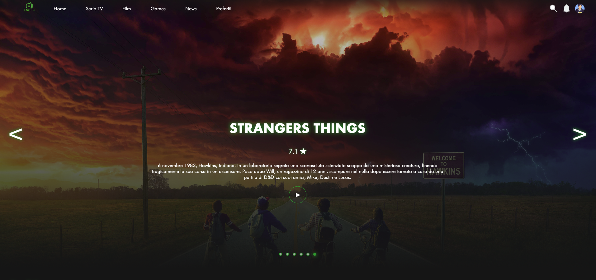
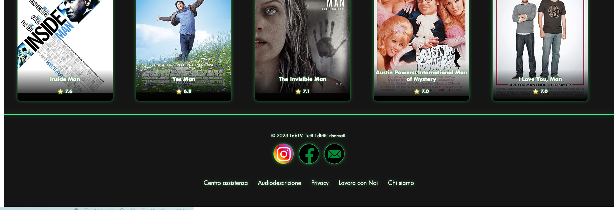
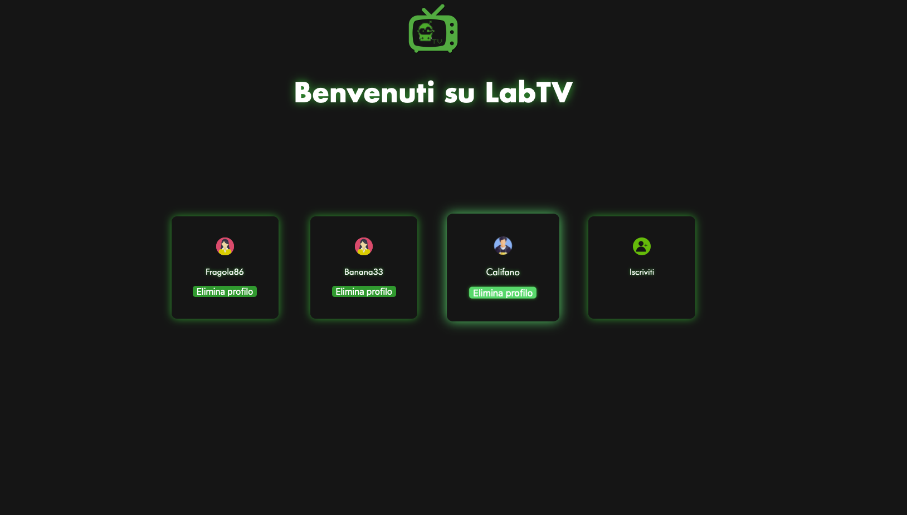
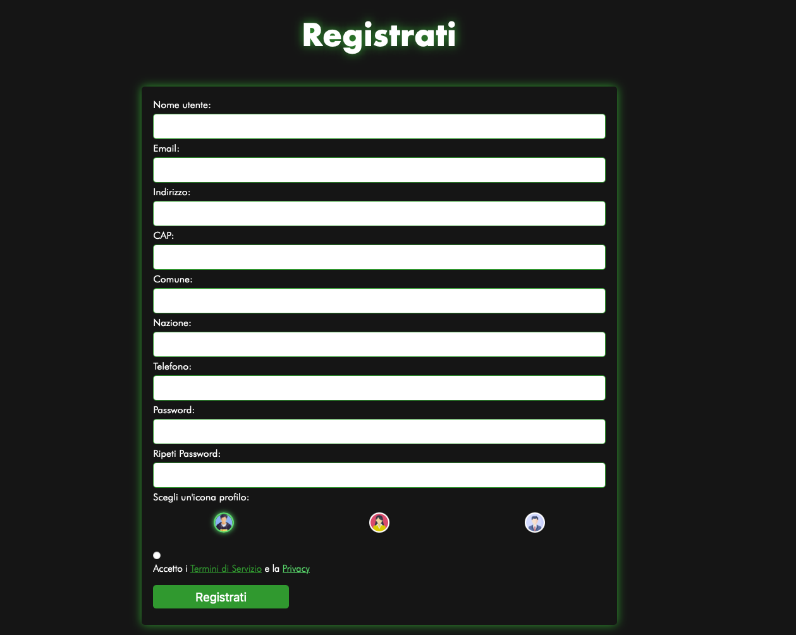

# LabTV

LabTV è un'applicazione web che permette di scoprire informazioni e trailer di film in modo semplice e veloce. Qui di seguito trovi una panoramica delle funzionalità principali, illustrate con screenshot reali dell'applicazione.

---

## Come funziona

### 1. Inserimento delle chiavi API

Per poter utilizzare LabTV sono necessarie due chiavi API:
- Una di [OMDb](https://www.omdbapi.com/) per recuperare le informazioni su film e serie TV.
- Una di [YouTube Data API](https://developers.google.com/youtube/v3) per ottenere i trailer video.

Le chiavi devono essere inserite in un file `esempio.js` nella cartella script del progetto:

```
OMDB_API_KEY = "YOUR_OMDB_API_KEY";
YOUTUBE_API_KEY = "YOUR_YOUTUBE_API_KEY";
```

---

### 2. Homepage e ricerca

All’avvio, LabTV presenta una schermata iniziale che consente di cercare immediatamente film o serie TV di interesse.



---

### 3. Risultati della ricerca

Dopo la ricerca, l'app mostra una pagina con tutte le informazioni disponibili ottenute tramite OMDb.


---

### 4. Footer

In fondo ad ogni pagina è presente il footer con link utili.



---

### 5. Gestione profili

LabTV include una sezione dedicata ai profili utente:



Per i nuovi utenti è disponibile una schermata di registrazione:



---

## Requisiti

- Node.js (se l'applicazione è basata su Node)
- Un browser aggiornato
- Chiavi API valide per OMDb e YouTube

---

## Installazione

1. Clona la repository:
   ```bash
   git clone https://github.com/Glitch-dn/Lab-TV.git
   cd Lab-TV
   ```
2. Installa le dipendenze:
   ```bash
   npm install
   ```
3. Inserisci le chiavi API come indicato sopra.
4. Avvia l’applicazione:
   ```bash
   npm start
   ```

---

## Note

- Le immagini presenti nella cartella `screen` sono fornite a scopo illustrativo e mostrano l’interfaccia dell’applicazione.
- Le API utilizzate possono avere limiti di utilizzo giornalieri.
